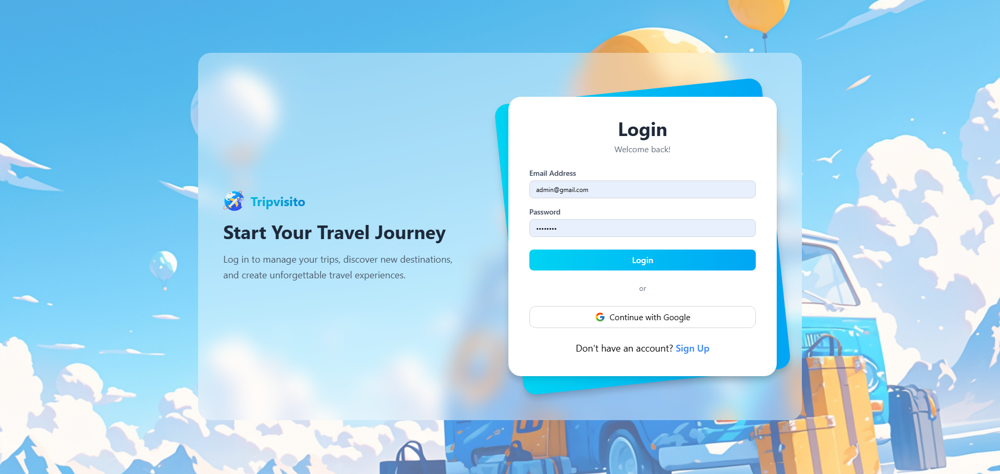
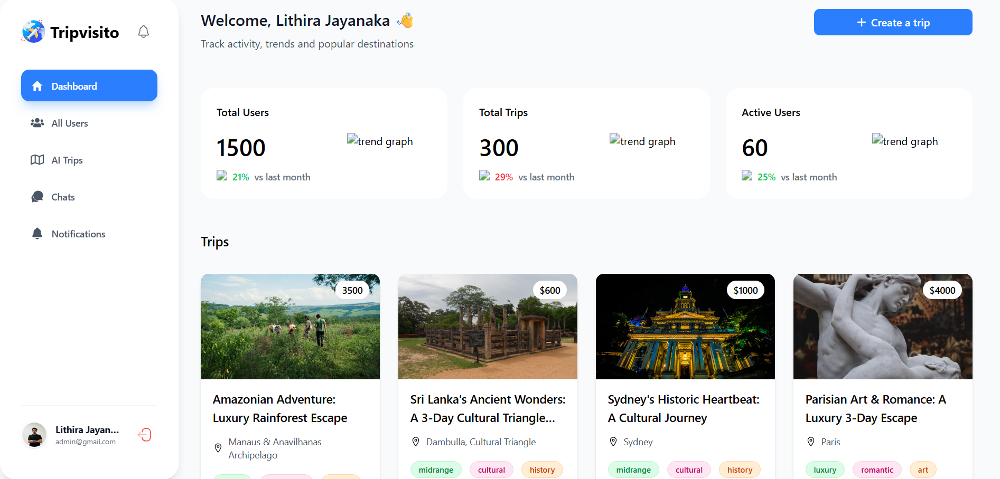

# 🌍 Trip Visito - React Frontend

<div align="center">


[](https://tripvisito.vercel.app)

**Modern, responsive frontend for Trip Visito Travel Management Platform**

[Features](#-features) • [Quick Start](#-quick-start) • [Components](#-components) • [Docker](#-docker)

</div>

---

## 📋 Table of Contents

- [Overview](#-overview)
- [Features](#-features)
- [Tech Stack](#-tech-stack)
- [Project Structure](#-project-structure)
- [Quick Start](#-quick-start)
- [Environment Variables](#-environment-variables)
- [Components](#-components)
- [Pages](#-pages)
- [Services](#-services)
- [Docker Deployment](#-docker-deployment)
- [Scripts](#-scripts)
- [Contributing](#-contributing)

---

## 🎯 Overview

Trip Visito's frontend is a cutting-edge React application built with TypeScript and Vite, featuring a stunning glassmorphism UI design, smooth animations, and a seamless user experience. The application provides intuitive interfaces for browsing trips, managing bookings, real-time chat, and comprehensive admin controls.

### Design Philosophy

- 🎨 **Modern Glassmorphism** - Frosted glass effects with backdrop blur
- ⚡ **Lightning Fast** - Vite for instant HMR and optimized builds
- 📱 **Fully Responsive** - Mobile-first design approach
- ♿ **Accessible** - WCAG compliant components
- 🎭 **Smooth Animations** - Framer Motion for delightful interactions

---

## ✨ Features

### User Interface
- ✅ Modern glassmorphism design with Tailwind CSS
- ✅ Smooth page transitions with Framer Motion
- ✅ Responsive navigation with mobile sidebar
- ✅ Interactive trip cards with hover effects
- ✅ Beautiful data visualizations with Chart.js
- ✅ Toast notifications for user feedback
- ✅ Loading states with custom travel loader
- ✅ World map integration for trip locations

### User Features
- ✅ Browse trips with search and filters
- ✅ View detailed trip information
- ✅ Secure authentication (Email/Google OAuth)
- ✅ Book trips with Stripe checkout
- ✅ Track booking status
- ✅ Leave reviews and ratings
- ✅ Real-time chat with admin
- ✅ View notifications
- ✅ Profile management

### Admin Features
- ✅ Analytics dashboard with charts
- ✅ User management interface
- ✅ Trip CRUD operations
- ✅ Payment tracking
- ✅ Review moderation
- ✅ Multi-user chat interface
- ✅ Real-time statistics

### Technical Features
- ✅ TypeScript for type safety
- ✅ Context API for state management
- ✅ Axios interceptors for API calls
- ✅ Socket.IO for real-time features
- ✅ Protected routes
- ✅ Error boundaries
- ✅ Code splitting
- ✅ SEO optimization

---

## 🛠 Tech Stack

### Core Technologies
- **React 19.2** - UI library
- **TypeScript 5.9** - Type safety
- **Vite 7.2** - Build tool & dev server

### Styling & UI
- **Tailwind CSS 4.1** - Utility-first CSS framework
- **Framer Motion 12.34** - Animation library
- **React Icons 5.5** - Icon library
- **clsx & tailwind-merge** - Conditional class utilities

### Data & Communication
- **Axios 1.13** - HTTP client
- **Socket.IO Client 4.8** - Real-time communication
- **Chart.js 4.5** - Data visualization
- **React Chart.js 2** - Chart.js wrapper for React

### Routing & Navigation
- **React Router DOM 7.9** - Client-side routing

### Authentication
- **@react-oauth/google** - Google OAuth integration

### Additional Libraries
- **Day.js** - Date manipulation
- **React Hot Toast** - Toast notifications
- **SweetAlert2** - Beautiful modals
- **SweetAlert2 React Content** - SweetAlert2 React wrapper

### Development Tools
- **ESLint** - Code linting
- **TypeScript ESLint** - TypeScript linting rules
- **Vite Plugin React** - React Fast Refresh

---

## 📁 Project Structure

```
tripvisito-react-frontend/
├── public/                         # Static assets
│
├── src/
│   ├── assets/                     # Images, icons, audio
│   │   ├── images/
│   │   ├── icons/
│   │   └── audio/
│   │
│   ├── components/                 # Reusable components
│   │   ├── Button.tsx             # Custom button component
│   │   ├── ChatBox.tsx            # Chat interface
│   │   ├── Chip.tsx               # Chip/Tag component
│   │   ├── ComboBox.tsx           # Dropdown select
│   │   ├── Footer.tsx             # Footer component
│   │   ├── Header.tsx             # Header component
│   │   ├── InfoPill.tsx           # Info badge
│   │   ├── MobileSideBar.tsx      # Mobile navigation
│   │   ├── NavBar.tsx             # Navigation bar
│   │   ├── NavItems.tsx           # Nav menu items
│   │   ├── Sidebar.tsx            # Desktop sidebar
│   │   ├── StatsCard.tsx          # Statistics card
│   │   ├── ThankyouMessage.tsx    # Success message
│   │   ├── TravelLoader.tsx       # Loading animation
│   │   ├── TrendChart.tsx         # Trend visualization
│   │   ├── TripCard.tsx           # Trip card component
│   │   ├── TripTrendsChart.tsx    # Trip trends chart
│   │   ├── UserGrowthChart.tsx    # User growth chart
│   │   └── WorldMap.tsx           # Interactive world map
│   │
│   ├── constants/                  # App constants
│   │   ├── index.ts               # General constants
│   │   └── world_map.ts           # Map configuration
│   │
│   ├── contexts/                   # React contexts
│   │   └── authContext.tsx        # Authentication context
│   │
│   ├── lib/                        # Utilities
│   │   ├── animations.ts          # Framer Motion variants
│   │   └── utils.ts               # Helper functions
│   │
│   ├── pages/                      # Page components
│   │   ├── LandingPage.tsx        # Home page
│   │   ├── LoginPage.tsx          # Login page
│   │   ├── RegisterPage.tsx       # Registration page
│   │   ├── Notifications.tsx      # Notifications page
│   │   ├── AdminLayout.tsx        # Admin layout wrapper
│   │   ├── LandingLayout.tsx      # Landing layout wrapper
│   │   ├── UserLayout.tsx         # User layout wrapper
│   │   │
│   │   ├── admin/                 # Admin pages
│   │   │   ├── Dashboard.tsx      # Admin dashboard
│   │   │   ├── AllUsers.tsx       # User management
│   │   │   ├── CreateUser.tsx     # Create user form
│   │   │   ├── ChatRoom.tsx       # Admin chat
│   │   │   └── TripsPage.tsx      # Trip management
│   │   │
│   │   ├── trip/                  # Trip pages
│   │   │   └── ...
│   │   │
│   │   └── user/                  # User pages
│   │       └── ...
│   │
│   ├── routes/                     # Route configuration
│   │   └── index.tsx              # Route definitions
│   │
│   ├── services/                   # API services
│   │   ├── api.ts                 # Axios configuration
│   │   ├── auth.ts                # Auth API calls
│   │   ├── chat.ts                # Chat API calls
│   │   ├── notification.ts        # Notification API
│   │   ├── overview.ts            # Dashboard API
│   │   ├── payment.ts             # Payment API
│   │   ├── review.ts              # Review API
│   │   └── trip.ts                # Trip API calls
│   │
│   ├── App.tsx                     # Main app component
│   ├── App.css                     # App-level styles
│   ├── main.tsx                    # Entry point
│   └── index.css                   # Global styles
│
├── dockerfile                      # Docker configuration
├── nginx.conf                      # Nginx config for production
├── eslint.config.js               # ESLint configuration
├── index.html                      # HTML template
├── package.json                    # Dependencies
├── tsconfig.json                   # TypeScript config
├── tsconfig.app.json              # App TypeScript config
├── tsconfig.node.json             # Node TypeScript config
├── vercel.json                     # Vercel deployment config
├── vite.config.ts                 # Vite configuration
└── README.md                       # This file
```

---

## 🚀 Quick Start

### Prerequisites

- Node.js 18 or higher
- npm or yarn
- Backend API running (see [backend setup](../tripvisito-express-backend/README.md))

### Installation

1. **Clone the repository**
   ```bash
   git clone https://github.com/LithiraJK/tripvisito-react-frontend.git
   cd tripvisito-react-frontend
   ```

2. **Install dependencies**
   ```bash
   npm install
   ```

3. **Setup environment variables**
   ```bash
   cp .env.example .env
   ```
   Edit `.env` with your configuration (see [Environment Variables](#-environment-variables))

4. **Run development server**
   ```bash
   npm run dev
   ```

5. **Build for production**
   ```bash
   npm run build
   npm run preview
   ```

The app will be available at `http://localhost:5173`

---

## 🔐 Environment Variables

Create a `.env` file in the root directory:

```env
# Backend API URL
VITE_API_BASE_URL=http://localhost:5000/api/v1

# Socket.IO Server URL
VITE_SOCKET_URL=http://localhost:5000

# Google OAuth Client ID
VITE_GOOGLE_CLIENT_ID=your_google_client_id

# Stripe Public Key
VITE_STRIPE_PUBLIC_KEY=pk_test_your_stripe_public_key

# Optional: Enable debug mode
VITE_DEBUG=true
```

### Production Environment

For production deployment on Vercel, add these environment variables in your Vercel dashboard:

```env
VITE_API_BASE_URL=https://tripvisito-express-backend-ow2e6cxc5.vercel.app/api/v1
VITE_SOCKET_URL=https://tripvisito-express-backend-ow2e6cxc5.vercel.app
VITE_GOOGLE_CLIENT_ID=your_production_google_client_id
VITE_STRIPE_PUBLIC_KEY=pk_live_your_stripe_public_key
```

---

## 🧩 Components

### Core Components

#### Button
Custom button component with variants and loading states.

```tsx
import Button from '@/components/Button';

<Button variant="primary" size="lg" loading={isLoading}>
  Submit
</Button>
```

#### ChatBox
Real-time chat component with Socket.IO integration.

```tsx
import ChatBox from '@/components/ChatBox';

<ChatBox userId={userId} />
```

#### TripCard
Display trip information with image, price, and rating.

```tsx
import TripCard from '@/components/TripCard';

<TripCard trip={tripData} />
```

#### TravelLoader
Animated loading component with travel-themed animation.

```tsx
import TravelLoader from '@/components/TravelLoader';

<TravelLoader />
```

### Chart Components

- **TrendChart** - General trend visualization
- **TripTrendsChart** - Trip booking trends
- **UserGrowthChart** - User registration growth
- **WorldMap** - Interactive map with trip locations

---

## 📄 Pages

### Public Pages

- **LandingPage** - Homepage with trip listings
- **LoginPage** - User authentication
- **RegisterPage** - User registration

### User Pages

- **Dashboard** - User dashboard with bookings
- **TripDetails** - Detailed trip information
- **Bookings** - User booking history
- **Profile** - User profile management
- **Reviews** - Leave and manage reviews

### Admin Pages

- **Dashboard** - Analytics and statistics
- **AllUsers** - User management interface
- **CreateUser** - Add new users
- **TripsPage** - Trip CRUD operations
- **ChatRoom** - Multi-user chat management
- **Payments** - Payment tracking

---

## 🔌 Services

### API Service (`api.ts`)

Axios instance with interceptors for authentication and error handling.

```typescript
import api from '@/services/api';

const response = await api.get('/trips');
```

### Auth Service (`auth.ts`)

```typescript
import { login, register, googleLogin } from '@/services/auth';

// Login
const { user, token } = await login(email, password);

// Google OAuth
const { user, token } = await googleLogin(googleToken);
```

### Trip Service (`trip.ts`)

```typescript
import { getAllTrips, getTripById, createTrip } from '@/services/trip';

// Get all trips
const trips = await getAllTrips({ page: 1, limit: 10 });

// Get trip details
const trip = await getTripById(tripId);
```

### Payment Service (`payment.ts`)

```typescript
import { createCheckoutSession } from '@/services/payment';

// Create payment session
const { sessionUrl } = await createCheckoutSession({
  tripId,
  numberOfPeople: 2,
  bookingDate: '2026-06-15'
});

// Redirect to Stripe checkout
window.location.href = sessionUrl;
```

---

## 🐳 Docker Deployment

### Build and Run with Docker

1. **Build the image**
   ```bash
   docker build -t tripvisito-frontend .
   ```

2. **Run the container**
   ```bash
   docker run -p 80:80 tripvisito-frontend
   ```

The app will be served by Nginx on port 80.

### Docker Compose

```yaml
version: '3.8'

services:
  frontend:
    build: .
    ports:
      - "80:80"
    environment:
      - VITE_API_BASE_URL=http://backend:5000/api/v1
    depends_on:
      - backend
```

---

## 📜 Scripts

| Command | Description |
|---------|-------------|
| `npm run dev` | Start development server with HMR |
| `npm run build` | Build for production |
| `npm run preview` | Preview production build locally |
| `npm run lint` | Run ESLint |

---

## 🎨 Theming & Styling

### Tailwind Configuration

The project uses Tailwind CSS 4.1 with custom configuration:

- Custom color palette
- Glassmorphism utilities
- Custom animations
- Responsive breakpoints

### Common Tailwind Classes

```tsx
// Glassmorphism effect
className="bg-white/10 backdrop-blur-md border border-white/20"

// Gradient backgrounds
className="bg-gradient-to-r from-blue-500 to-purple-600"

// Animations
className="animate-fade-in hover:scale-105 transition-transform"
```

### Framer Motion Animations

Common animation variants in `lib/animations.ts`:

```typescript
// Fade in animation
<motion.div variants={fadeIn} initial="initial" animate="animate">
  Content
</motion.div>

// Slide up animation
<motion.div variants={slideUp} initial="initial" animate="animate">
  Content
</motion.div>
```

---

## 🔒 Authentication Flow

1. User enters credentials or uses Google OAuth
2. Frontend sends request to `/api/v1/auth/login` or `/api/v1/auth/google`
3. Backend validates and returns JWT token
4. Token stored in localStorage
5. Axios interceptor adds token to all subsequent requests
6. Protected routes check authentication state
7. Auto-redirect to login if unauthenticated

---

## 🌐 Deployment

### Vercel Deployment (Recommended)

1. **Install Vercel CLI**
   ```bash
   npm install -g vercel
   ```

2. **Deploy**
   ```bash
   vercel
   ```

3. **Set environment variables** in Vercel dashboard

### Manual Build

```bash
npm run build
# Upload dist/ folder to your hosting service
```

---

## 🔗 Links

- **Live Demo:** [https://tripvisito.vercel.app](https://tripvisito.vercel.app)
- **Backend Repository:** [tripvisito-express-backend](https://github.com/LithiraJK/tripvisito-express-backend)
- **Backend API:** [https://tripvisito-express-backend-ow2e6cxc5.vercel.app](https://tripvisito-express-backend-ow2e6cxc5.vercel.app)

---

## 🤝 Contributing

1. Fork the repository
2. Create your feature branch (`git checkout -b feature/AmazingFeature`)
3. Commit your changes (`git commit -m 'Add some AmazingFeature'`)
4. Push to the branch (`git push origin feature/AmazingFeature`)
5. Open a Pull Request

### Coding Standards

- Use TypeScript for all new components
- Follow existing component structure
- Write meaningful commit messages
- Add comments for complex logic
- Test on multiple screen sizes

---

## 📸 Screenshots

### Landing Page


### Login Page


### Admin Dashboard


### User Dashboard


---

## 👨‍💻 Author

**Lithira Jayanaka**

- GitHub: [@LithiraJK](https://github.com/LithiraJK)
- LinkedIn: [Lithira Jayanaka](https://linkedin.com/in/lithira-jayanaka)
- Email: lithira.jayanaka.official@gmail.com

---

## 📄 License

This project is licensed under the MIT License.

---

<div align="center">

**Built with ⚡ Vite + ⚛️ React + 💙 TypeScript**

⭐ Star this repository if you find it helpful!

</div>